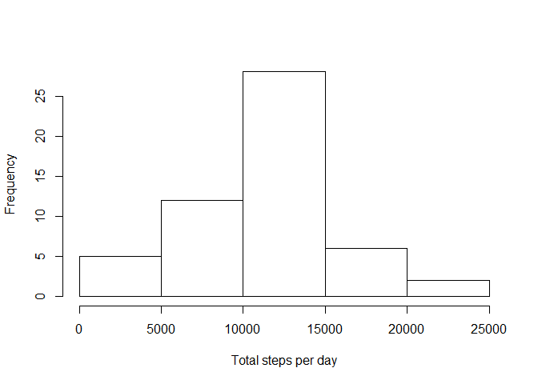
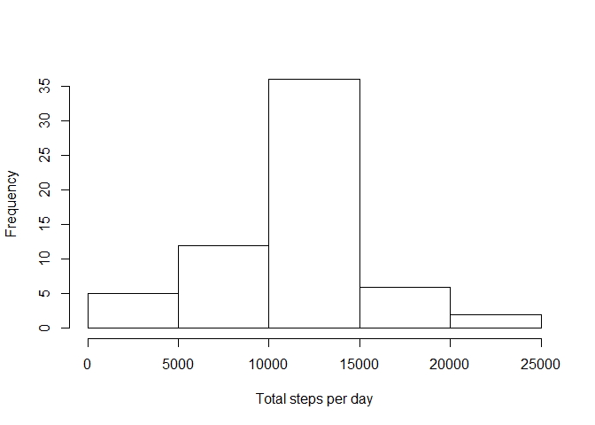

# Reproducible Research: Peer Assessment 1


## Loading and preprocessing the data

1) 

The Data is unzipped then loaded into R using:


```r
unzip("activity.zip")
activity<-read.csv("activity.csv", stringsAsFactors=FALSE)
```

2) 

In order to make analysis easier the class of the columns is changed: 

The date column in the resulting data.frame is converted from character to POSIXlt/ POSIXt. 

The Other two columns are converted to numeric from interger. 


```r
activity$date<-strptime(activity$date,"%Y-%m-%d")
activity$steps<-as.numeric(activity$steps)
activity$interval<-as.numeric(activity$interval)
```

## What is mean total number of steps taken per day?

1) 

ddply from the plyr package is used to calculate the total steps for each date


```r
library(plyr)
```

```
## Warning: package 'plyr' was built under R version 3.1.1
```

```r
DayTotal<-ddply(activity, .(date), summarize, steps=sum(steps))
```

A basic histogram of the total number of step taken each day is plotted with the base plotting system.


```r
hist(DayTotal$steps, xlab="Total steps per day", main=NULL)
```

 

2)


```r
mean<-mean(DayTotal$steps,na.rm=TRUE)
```

The mean of the total number of steps per day is 1.0766 &times; 10<sup>4</sup>


```r
median<-median(DayTotal$steps,na.rm=TRUE)
```
 The median is 1.0765 &times; 10<sup>4</sup>
 
## What is the average daily activity pattern?

1)

ddply is used to create an average day dataset. (n.b: the plyr package has already been loaded)


```r
AverageDay<-ddply(activity, .(interval), summarize, steps=mean(steps,na.rm=TRUE))
```

From this a time series plot is created using the ggplot system


```r
library(ggplot2)
```

```
## Warning: package 'ggplot2' was built under R version 3.1.1
```

```r
qplot(interval,steps, data=AverageDay,geom="line")
```

 

2)


```r
Max<-AverageDay$interval[AverageDay$steps==max(AverageDay$steps)]
```

The time interval with the highest number of average steps is 835

## Imputing missing values

1)


```r
na<-sum(is.na(activity))
```
 
The total number of missing values is 2304

2)

My strategy for filling these is to use the mean value for that 5-minute interval; calculated in the previous section with the values in the data.frame AverageDay.

3)

The following code is used to create the new dataset, with replace na values


```r
names(AverageDay)[2]<-"MeanSteps"
New<-merge(activity,AverageDay, by="interval")
Nas<-is.na(New$steps)
New$steps[Nas]<-New$MeanSteps[Nas]
```

4)

A histogram of the total number of steps taken each day is produce from the New dataset by re-employing the previous method.


```r
NewDayTotal<-ddply(New, .(date), summarize, steps=sum(steps))
hist(NewDayTotal$steps, xlab="Total steps per day", main=NULL)
```

 


```r
NewMedian<-median(NewDayTotal$steps,na.rm=TRUE)
NewMean<-mean(NewDayTotal$steps,na.rm=TRUE)
```

The new mean total is 1.0766 &times; 10<sup>4</sup>, and the new Median is 1.0766 &times; 10<sup>4</sup>

```r
MeanDif<-mean-NewMean
MedianDif<-median-NewMedian
```
The difference between the two means is 0. The difference in the Medians is -1.1887

## Are there differences in activity patterns between weekdays and weekends?

1)

A new column is added to the New database, identifying weekdays and weekends, with the following:


```r
New$dayFactor<-ifelse(weekdays(New$date) %in% c("Saturday", "Sunday"),
       "weekend","weekday")
```

2)

The data is then split by this column, the average steps per interval is calculated for both groups and the data is recombined. 


```r
Weekend<-New$dayFactor=="weekend"
WeekendData<-New[Weekend,]
WeekdayData<-New[!Weekend,]
AverageWeekday<-ddply(WeekdayData, .(interval), summarize, steps=mean(steps,na.rm=TRUE))
AverageWeekend<-ddply(WeekendData, .(interval), summarize, steps=mean(steps,na.rm=TRUE))
AverageWeekend$DayFactor<-as.character("weekend")
AverageWeekday$DayFactor<-as.character("weekday")
AverageCombined<-rbind(AverageWeekday, AverageWeekend)
```

The ggplot2 system is employed to create a panel time series plot.


```r
qplot(interval,steps, data=AverageCombined,geom="line",facets=DayFactor~.)
```

 
